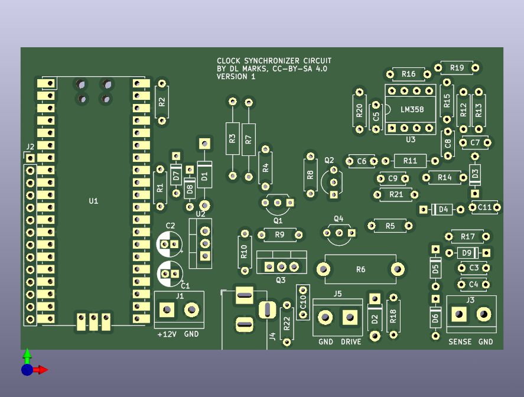

# Synchronizer

Keep a mechanical pendulum clock on time by disciplining it to NTP or GPS —
**without modifying the clock in any way.**

The device sits behind the clock. Two coils reach through the back of the
case: one listens to the pendulum, the other nudges it. Nothing is glued to
the bob, nothing is drilled, nothing is tapped into the movement. Take the
device away and you have an ordinary pendulum clock again.

## How it works

A pendulum clock keeps time by counting swings. If the pendulum runs a
little fast or slow — and they all do, with temperature, with the mainspring
unwinding, with the barometric pressure — the hands drift. The usual fix is
to adjust the rating nut and accept a few seconds a day.

This device measures the pendulum against an accurate reference and gives it
a very small push, at the right moment, to hold it on time.

### Sensing the pendulum

The **sense coil** is an air-cored coil of many turns. It sits behind the
case, near one end of the pendulum's travel, and forms a parallel resonant
tank with C3 (in parallel with C4, an optional trim position). The firmware
drives that tank at its resonant frequency with a square wave.

When the bob swings past, it changes the coil's inductance and loads it with
eddy-current loss. Either way the tank is pulled off resonance, its
impedance falls, and the voltage across it drops. An LM358 amplifies that,
and the result is read two ways: as the raw waveform, and through an
envelope detector that turns it into a slow bump. The bump is the bob going
past.

Arrival time is taken as the **midpoint between the two threshold
crossings**, not the peak. At the end of its travel the bob is nearly
stationary, so the bump is broad and its peak is poorly localised — but the
two flanks are steep and symmetric about the turning point.

### Nudging the pendulum

The **drive coil** is wound on a soft iron core and sits at the other end of
the swing. Energising it attracts the bob's steel backing. It can only pull,
never push, so correction is entirely a matter of *when*:

- pulse **just before** the bob arrives → it gets there sooner → **the clock
  advances**
- pulse **just after** it turns and starts back → it is held a moment
  longer → **the clock retards**

The pushes needed are tiny. On the development clock, correcting 11 s/day
works out to about **113 microseconds of retard per swing** — far too little
to deliver as a pulse every swing. So the firmware accumulates the demand
and spends it whole: one short pulse every few dozen swings.

### Keeping time

A Raspberry Pi Pico W runs the whole thing, and serves a web interface for
everything else — status, calibration, tuning. Setting one up needs no
serial terminal and no app: a board with no network raises its own access
point, and joining it opens the setup form.

It gets the time over Wi-Fi by NTP, and keeps a model of UTC that NTP
corrects in both phase *and* rate —
the RP2040's crystal is only good to around 30 ppm, which is 2.6 s/day, a
sizeable fraction of the error being removed. A GPS receiver can be wired to
the expansion header later.

## The hardware

A single board, 99 × 62 mm, all through-hole parts. It is deliberately
**single-sided** — every track is on the bottom copper, with no vias and no
jumpers — so it can be milled at home if need be, though the boards in the
photo were commercially made.

### Connections

| | |
|---|---|
| **J1** | +12 V input, screw terminal |
| **J4** | +12 V input, barrel jack (wired in parallel with J1) |
| **J3** | Sense coil, screw terminal |
| **J5** | Drive coil, screw terminal |
| **J2** | 14-pin expansion header |

J2 carries GPIO5–GPIO15 with three grounds, for a GPS receiver or anything
else. GPIO12 and GPIO13 are UART0 TX/RX, on pins 10 and 11.

### Circuit blocks

**Power.** 12 V in, a 7805 down to 5 V, then a 1N5819 Schottky (D1) feeding
the Pico's VBUS and the LM358's supply. The diode is what lets you plug in
USB without back-feeding the regulator.

**Tank drive.** GPIO2 → Q1 (2N3904) → Q2 (2N3906), which injects into the
sense tank through R5 from the 12 V rail. A square wave at resonance.

**Amplifier.** Two inverting LM358 stages, both with 100 kΩ feedback,
biased to about 1.5 V so they run from a single supply. The op-amp is
socketed.

The first stage is fed from the tank through C6, only 100 pF, so its
reactance — roughly 80 kΩ at 20 kHz — dominates the 10 kΩ input resistor.
That makes the stage a gentle high-pass of about ×1.3 at 20 kHz rising with
frequency, rather than a flat ×10. C6 is a light tap on the tank rather than
a load on it, and it also adds its own 100 pF to the tank's capacitance
alongside C3. The second stage is AC-coupled through C8 and does run at
about ×10.

**Detectors.** The amplified waveform goes to ADC1 through R20. It also goes
through R19 and C11 into a clamp-and-rectify envelope detector (D3, D4) with
C9 and R21 setting the decay, and that goes to ADC0. D7 and D8 clamp both
ADC inputs to 3V3; D5, D6 and D9 clamp the tank input.

**Drive.** GPIO4 → Q4 (2N3904) → pulls the gate of Q3, an IRF9540N P-channel
MOSFET, whose source sits on +12 V. **GPIO4 high energises the coil.** The
current runs through R6, a 10 Ω power resistor. D2 (UF4007) is the flyback
clamp across the coil, and R22 with C10 snubs the switching node. R17 and
R18 are unpopulated positions for damping the coils if you need it.

> **A word of caution about R6.** The coil's DC resistance depends on what
> you wind, and R6 is in series with it across 12 V. A pulse left on could
> put several watts into that resistor. The firmware bounds every pulse
> three independent ways — a hard ceiling on width, a watchdog timer that
> drops the pin regardless of what the rest of the code believes, and a
> token bucket capping the long-run duty cycle — and the pin is driven low
> before anything else initialises. Keep those limits in mind before
> widening the default pulse.

### Pin assignments

| Signal | Pico | Function |
|---|---|---|
| `/OSCIL` | GPIO2 | tank drive, square wave at resonance |
| `/PULSE` | GPIO4 | drive coil; **high = coil energised** |
| `/AMPLITUDE` | GPIO26 / ADC0 | envelope detector output |
| `/OSC_SIGNAL` | GPIO27 / ADC1 | amplified tank waveform |

## Repository layout

| | |
|---|---|
| `board/` | KiCad 7 project — schematic, PCB, gerbers, and a pcb2gcode setup for milling |
| `Code/synchronizer/` | Pico W firmware. See [its README](Code/synchronizer/README.md) for build and bring-up. |
| `CAD/` | FreeCAD models of the coil form and a coil form with a PCB holder, plus an STL |
| `Simulations/` | Qucs-S / ngspice models of the coil sensor and the coil pulser |

## Status

The board is built and the firmware compiles, but the loop has not yet run
against a real clock. The one quantity it cannot derive is the **phase shift
one drive pulse produces** — that is the loop gain, and the firmware has a
`MEASURE` command to find it. Until it is measured, the loop will track and
report but refuses to fire.

Bring-up order, and the web interface, are in the
[firmware README](Code/synchronizer/README.md).

## Other clocks

Nothing in the firmware assumes a particular movement. Pendulum period,
escapement, gear ratio, coil placement and detector timing are all
configurable and stored in flash. The defaults describe the clock this was
developed against, and are only a starting point.

That clock is a 31-day wall clock about 40 cm tall. Measured from a
three-minute recording of its escapement:

- full swing period **0.857030 s** — nominally 6/7 s
- **8400 beats/hour**, 140 beats/min, **4200 full swings/hour**
- pendulum about **18.3 cm**
- runs roughly **11 s/day fast**
- **203 ms out of beat**, stably — the escapement releases at 0.678 of peak
  swing, where the bob still has 73% of its top speed, so it runs happily
  that way

Note that the bob only reaches each end of its travel once per full period,
so a coil at one extreme sees it 4200 times an hour, not 8400.

## Licence

The board carries **CC BY-SA 4.0** on its silkscreen. The firmware sources
each carry a zlib-style permissive notice. There is no separate `LICENSE`
file yet.

Daniel Marks
